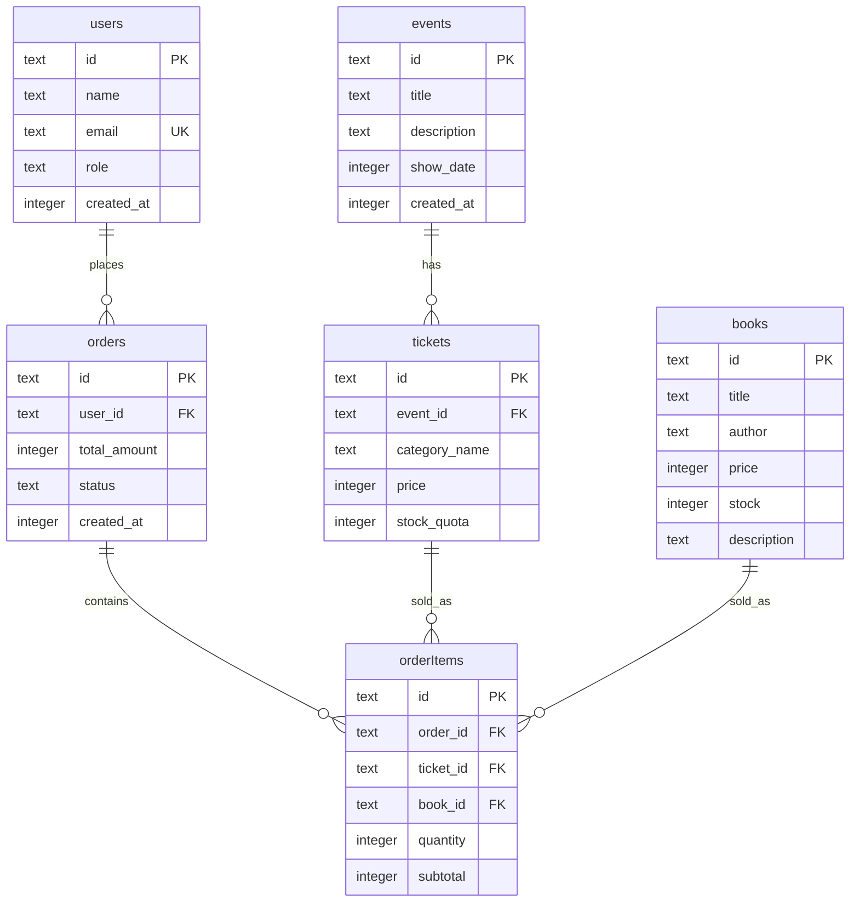

# Design Document: Database Schema Setup

## Overview

This design document specifies the technical implementation for setting up a database schema and Drizzle ORM integration for an e-ticketing and bookstore web application. The system uses Turso (libSQL) as the database provider and Drizzle ORM for type-safe database operations in a Next.js App Router environment.

The implementation consists of two primary modules:

1. **Schema Module** (`src/db/schema.ts`): Defines all database table structures using Drizzle ORM's SQLite schema builder
2. **Database Client Module** (`src/db/index.ts`): Initializes and exports the configured Drizzle client connected to Turso

This design addresses all requirements for user management, event ticketing, book inventory, and order processing with proper referential integrity and constraint enforcement.

## Architecture

### Module Structure

```text
src/
└── db/
    ├── schema.ts          # Table schema definitions
    └── index.ts           # Database client initialization and export
```

### Technology Stack

- **Database**: Turso (libSQL) - distributed SQLite service
- **ORM**: Drizzle ORM v0.45.2
- **Database Client**: @libsql/client v0.17.3
- **Runtime**: Next.js 16.2.6 App Router
- **Language**: TypeScript 5.x

### Design Principles

1. **Type Safety**: Leverage Drizzle ORM's type inference for compile-time safety
2. **Constraint Enforcement**: Use database-level constraints for data integrity
3. **Referential Integrity**: Implement foreign key relationships with appropriate cascade behaviors
4. **Environment-Based Configuration**: Use environment variables for database credentials
5. **Single Responsibility**: Separate schema definitions from client initialization

## Components and Interfaces

### Schema Module (`src/db/schema.ts`)

The schema module defines six interconnected tables using Drizzle ORM's `sqliteTable` function from `drizzle-orm/sqlite-core`.

#### Users Table

**Purpose**: Store user account information with role-based access control

**Schema Definition**:

```typescript
export const users = sqliteTable(
  "users",
  {
    id: text("id", { length: 255 }).primaryKey().notNull(),
    name: text("name", { length: 255 }).notNull(),
    email: text("email", { length: 320 }).notNull().unique(),
    role: text("role", { length: 50 }).notNull(),
    createdAt: integer("created_at", { mode: "timestamp" }).notNull(),
  },
  (table) => ({
    roleCheck: check("role_check", sql`${table.role} IN ('ADMIN', 'CUSTOMER')`),
    emailCheck: check("email_check", sql`${table.email} LIKE '%@%.%'`),
  }),
);
```

**Constraints**:

- Primary key: `id` (text, max 255 chars)
- Unique: `email`
- Check: `role` must be 'ADMIN' or 'CUSTOMER'
- Check: `email` must match pattern `%@%.%`
- All columns except `id` are NOT NULL

**Type Export**:

```typescript
export type User = typeof users.$inferSelect;
export type NewUser = typeof users.$inferInsert;
```

#### Events Table

**Purpose**: Store event information for ticket sales

**Schema Definition**:

```typescript
export const events = sqliteTable(
  "events",
  {
    id: text("id", { length: 36 }).primaryKey().notNull(),
    title: text("title", { length: 200 }).notNull(),
    description: text("description", { length: 2000 }),
    showDate: integer("show_date", { mode: "timestamp" }).notNull(),
    createdAt: integer("created_at", { mode: "timestamp" }).notNull(),
  },
  (table) => ({
    titleCheck: check("title_check", sql`LENGTH(${table.title}) > 0`),
  }),
);
```

**Constraints**:

- Primary key: `id` (text, max 36 chars for UUID)
- Check: `title` must not be empty string
- `description` is nullable
- All other columns are NOT NULL

**Type Export**:

```typescript
export type Event = typeof events.$inferSelect;
export type NewEvent = typeof events.$inferInsert;
```

#### Tickets Table

**Purpose**: Store ticket inventory linked to events

**Schema Definition**:

```typescript
export const tickets = sqliteTable(
  "tickets",
  {
    id: text("id").primaryKey().notNull(),
    eventId: text("event_id")
      .notNull()
      .references(() => events.id, { onDelete: "cascade" }),
    categoryName: text("category_name").notNull(),
    price: integer("price").notNull(),
    stockQuota: integer("stock_quota").notNull(),
  },
  (table) => ({
    priceCheck: check("price_check", sql`${table.price} >= 0`),
    stockCheck: check("stock_check", sql`${table.stockQuota} >= 0`),
  }),
);
```

**Constraints**:

- Primary key: `id` (text)
- Foreign key: `eventId` references `events.id` with CASCADE on delete
- Check: `price >= 0`
- Check: `stockQuota >= 0`
- All columns are NOT NULL

**Type Export**:

```typescript
export type Ticket = typeof tickets.$inferSelect;
export type NewTicket = typeof tickets.$inferInsert;
```

#### Books Table

**Purpose**: Store book inventory for sale

**Schema Definition**:

```typescript
export const books = sqliteTable(
  "books",
  {
    id: text("id").primaryKey().notNull(),
    title: text("title", { length: 500 }).notNull(),
    author: text("author", { length: 200 }).notNull(),
    price: integer("price").notNull(),
    stock: integer("stock").notNull(),
    description: text("description", { length: 2000 }),
  },
  (table) => ({
    priceCheck: check("price_check", sql`${table.price} >= 0`),
    stockCheck: check("stock_check", sql`${table.stock} >= 0`),
  }),
);
```

**Constraints**:

- Primary key: `id` (text)
- Check: `price >= 0`
- Check: `stock >= 0`
- `description` is nullable
- All other columns are NOT NULL

**Type Export**:

```typescript
export type Book = typeof books.$inferSelect;
export type NewBook = typeof books.$inferInsert;
```

#### Orders Table

**Purpose**: Track customer purchases and payment status

**Schema Definition**:

```typescript
export const orders = sqliteTable(
  "orders",
  {
    id: text("id", { length: 255 }).primaryKey().notNull(),
    userId: text("user_id", { length: 255 })
      .notNull()
      .references(() => users.id, { onDelete: "restrict" }),
    totalAmount: integer("total_amount").notNull(),
    status: text("status", { length: 50 }).notNull().default("PENDING"),
    createdAt: integer("created_at", { mode: "timestamp" }).notNull(),
  },
  (table) => ({
    totalCheck: check("total_check", sql`${table.totalAmount} >= 0`),
    statusCheck: check(
      "status_check",
      sql`${table.status} IN ('PENDING', 'PAID', 'CANCELLED')`,
    ),
  }),
);
```

**Constraints**:

- Primary key: `id` (text, max 255 chars)
- Foreign key: `userId` references `users.id` with RESTRICT on delete
- Check: `totalAmount >= 0`
- Check: `status` must be 'PENDING', 'PAID', or 'CANCELLED'
- Default: `status` defaults to 'PENDING'
- All columns are NOT NULL

**Type Export**:

```typescript
export type Order = typeof orders.$inferSelect;
export type NewOrder = typeof orders.$inferInsert;
```

#### Order Items Table

**Purpose**: Store individual line items for each order with support for both tickets and books

**Schema Definition**:

```typescript
export const orderItems = sqliteTable(
  "order_items",
  {
    id: text("id").primaryKey().notNull(),
    orderId: text("order_id")
      .notNull()
      .references(() => orders.id, { onDelete: "cascade" }),
    ticketId: text("ticket_id").references(() => tickets.id, {
      onDelete: "restrict",
    }),
    bookId: text("book_id").references(() => books.id, {
      onDelete: "restrict",
    }),
    quantity: integer("quantity").notNull(),
    subtotal: integer("subtotal").notNull(),
  },
  (table) => ({
    quantityCheck: check("quantity_check", sql`${table.quantity} >= 1`),
    subtotalCheck: check("subtotal_check", sql`${table.subtotal} >= 0`),
    itemTypeCheck: check(
      "item_type_check",
      sql`
    (${table.ticketId} IS NOT NULL AND ${table.bookId} IS NULL) OR
    (${table.ticketId} IS NULL AND ${table.bookId} IS NOT NULL)
  `,
    ),
  }),
);
```

**Constraints**:

- Primary key: `id` (text)
- Foreign key: `orderId` references `orders.id` with CASCADE on delete
- Foreign key: `ticketId` references `tickets.id` with RESTRICT on delete (nullable)
- Foreign key: `bookId` references `books.id` with RESTRICT on delete (nullable)
- Check: `quantity >= 1`
- Check: `subtotal >= 0`
- Check: Exactly one of `ticketId` or `bookId` must be non-null (XOR constraint)
- `orderId`, `quantity`, and `subtotal` are NOT NULL
- `ticketId` and `bookId` are nullable

**Type Export**:

```typescript
export type OrderItem = typeof orderItems.$inferSelect;
export type NewOrderItem = typeof orderItems.$inferInsert;
```

### Database Client Module (`src/db/index.ts`)

**Purpose**: Initialize and export the Drizzle database client connected to Turso

**Implementation Strategy**:

1. **Environment Variable Validation**: Check for required `TURSO_CONNECTION_URL` and `TURSO_AUTH_TOKEN` before initialization
2. **LibSQL Client Creation**: Use `@libsql/client` to create a connection to Turso
3. **Drizzle Client Initialization**: Wrap the libSQL client with Drizzle's `drizzle()` function
4. **Schema Import**: Import all schema definitions for type inference
5. **Client Export**: Export the configured client for application-wide use

**Interface**:

```typescript
import { drizzle } from "drizzle-orm/libsql";
import { createClient } from "@libsql/client";
import * as schema from "./schema";

// Exported database client
export const db: ReturnType<typeof drizzle<typeof schema>>;

// Re-export schema for convenience
export { schema };
```

**Error Handling**:

- Throw error with message "TURSO_CONNECTION_URL is required" if URL is missing
- Throw error with message "TURSO_AUTH_TOKEN is required" if token is missing
- Propagate libSQL connection errors with original error message

## Data Models

### Entity Relationship Diagram



### Data Type Conventions

1. **IDs**: Text type to support UUIDs, ULIDs, or custom ID schemes
2. **Timestamps**: Integer type storing Unix timestamps in seconds (using Drizzle's `{ mode: 'timestamp' }`)
3. **Money**: Integer type storing amounts in smallest currency unit (cents) to avoid floating-point precision issues
4. **Enums**: Text type with CHECK constraints for type safety at database level
5. **Quantities**: Integer type with CHECK constraints for non-negative values

### Referential Integrity Strategy

**CASCADE on Delete**:

- `tickets.eventId → events.id`: When an event is deleted, all associated tickets are deleted
- `orderItems.orderId → orders.id`: When an order is deleted, all line items are deleted

**RESTRICT on Delete**:

- `orders.userId → users.id`: Cannot delete a user who has orders
- `orderItems.ticketId → tickets.id`: Cannot delete a ticket that appears in an order
- `orderItems.bookId → books.id`: Cannot delete a book that appears in an order

This strategy ensures:

- Event deletion cleans up orphaned tickets automatically
- Order deletion cleans up orphaned line items automatically
- Historical order data is preserved (cannot delete users/products with orders)

## Correctness Properties

**Note**: This feature does not include property-based testing because it consists of Infrastructure as Code (database schema definitions) and configuration (database client initialization), which are declarative specifications rather than algorithms with testable universal properties.

The acceptance criteria focus on structural requirements (table definitions, column types, constraints), configuration validation (environment variables), and referential integrity rules (foreign key relationships). These cannot be expressed as "for all inputs X, property P(X) holds" statements.

**Testing approach**: This feature uses schema validation tests, constraint enforcement tests, foreign key behavior tests, configuration tests, and TypeScript type safety verification instead of property-based testing. See the Testing Strategy section for detailed specifications.

## Error Handling

### Database Client Initialization Errors

**Missing Environment Variables**:

```typescript
if (!process.env.TURSO_CONNECTION_URL) {
  throw new Error("TURSO_CONNECTION_URL is required");
}
if (!process.env.TURSO_AUTH_TOKEN) {
  throw new Error("TURSO_AUTH_TOKEN is required");
}
```

**Connection Failures**:

- LibSQL client connection errors should propagate with their original error messages
- These errors will be thrown during module initialization, causing the application to fail fast
- This is intentional: the application cannot function without database connectivity

### Schema Constraint Violations

**Check Constraint Violations**:

- Drizzle ORM will throw errors when attempting to insert/update data that violates CHECK constraints
- Error messages will include the constraint name (e.g., `role_check`, `email_check`)
- Application code should validate data before database operations to provide user-friendly error messages

**Foreign Key Violations**:

- RESTRICT constraints will throw errors when attempting to delete referenced records
- CASCADE constraints will automatically delete dependent records
- Application code should handle these errors and provide appropriate feedback

**Unique Constraint Violations**:

- Attempting to insert duplicate email addresses will throw a unique constraint violation
- Application code should check for existing records before insertion or handle the error gracefully

### Runtime Type Safety

Drizzle ORM provides compile-time type safety through TypeScript inference:

- `$inferSelect` types represent rows returned from SELECT queries
- `$inferInsert` types represent data for INSERT operations (with optional fields for defaults)
- TypeScript will catch type mismatches before runtime

## Testing Strategy

### Why Property-Based Testing Does Not Apply

This feature is primarily **Infrastructure as Code** (database schema definitions) and **configuration** (database client initialization). The acceptance criteria focus on:

- Schema structure and column definitions
- Constraint declarations (CHECK, UNIQUE, FOREIGN KEY)
- Configuration validation (environment variables)

These are **declarative specifications**, not algorithms or data transformations with universal properties. There are no meaningful "for all inputs X, property P(X) holds" statements to test.

### Recommended Testing Approach

#### 1. Schema Validation Tests (Unit Tests)

**Purpose**: Verify that schema definitions match requirements

**Approach**:

- Use Drizzle Kit's introspection to validate schema structure
- Test that tables, columns, and constraints are defined correctly
- Verify type exports are available

**Example Test Cases**:

```typescript
describe("Users Table Schema", () => {
  it("should have all required columns with correct types", () => {
    // Verify users table has id, name, email, role, createdAt columns
  });

  it("should have email unique constraint", () => {
    // Verify unique constraint exists on email column
  });

  it("should have role check constraint", () => {
    // Verify CHECK constraint for role values
  });
});
```

#### 2. Constraint Enforcement Tests (Integration Tests)

**Purpose**: Verify that database constraints are enforced at runtime

**Approach**:

- Use an in-memory SQLite database for testing
- Attempt to insert/update data that violates constraints
- Assert that appropriate errors are thrown

**Example Test Cases**:

```typescript
describe("Users Table Constraints", () => {
  it("should reject invalid role values", async () => {
    await expect(
      db.insert(users).values({
        id: "1",
        name: "Test",
        email: "test@example.com",
        role: "INVALID",
        createdAt: new Date(),
      }),
    ).rejects.toThrow();
  });

  it("should reject duplicate email addresses", async () => {
    await db.insert(users).values({
      id: "1",
      name: "Test",
      email: "test@example.com",
      role: "CUSTOMER",
      createdAt: new Date(),
    });

    await expect(
      db.insert(users).values({
        id: "2",
        name: "Test2",
        email: "test@example.com",
        role: "CUSTOMER",
        createdAt: new Date(),
      }),
    ).rejects.toThrow();
  });
});
```

#### 3. Foreign Key Relationship Tests (Integration Tests)

**Purpose**: Verify CASCADE and RESTRICT behaviors

**Approach**:

- Create related records across tables
- Test deletion behaviors
- Verify referential integrity is maintained

**Example Test Cases**:

```typescript
describe("Foreign Key Relationships", () => {
  it("should cascade delete tickets when event is deleted", async () => {
    // Create event and tickets
    // Delete event
    // Verify tickets are also deleted
  });

  it("should restrict deletion of user with orders", async () => {
    // Create user and order
    // Attempt to delete user
    // Verify error is thrown
  });

  it("should enforce XOR constraint on order items", async () => {
    // Attempt to create order item with both ticketId and bookId
    // Verify error is thrown
    // Attempt to create order item with neither
    // Verify error is thrown
  });
});
```

#### 4. Database Client Initialization Tests (Unit Tests)

**Purpose**: Verify environment variable validation and error handling

**Approach**:

- Mock environment variables
- Test initialization with missing/invalid credentials
- Verify appropriate errors are thrown

**Example Test Cases**:

```typescript
describe("Database Client Initialization", () => {
  it("should throw error when TURSO_CONNECTION_URL is missing", () => {
    delete process.env.TURSO_CONNECTION_URL;
    expect(() => require("./db")).toThrow("TURSO_CONNECTION_URL is required");
  });

  it("should throw error when TURSO_AUTH_TOKEN is missing", () => {
    delete process.env.TURSO_AUTH_TOKEN;
    expect(() => require("./db")).toThrow("TURSO_AUTH_TOKEN is required");
  });
});
```

#### 5. Type Safety Tests (Compile-Time)

**Purpose**: Verify TypeScript types are correctly inferred

**Approach**:

- Use TypeScript's type system to catch errors at compile time
- Create test files that attempt invalid operations
- Verify TypeScript compiler catches type errors

**Example**:

```typescript
// This should compile
const validUser: NewUser = {
  id: "1",
  name: "Test",
  email: "test@example.com",
  role: "CUSTOMER",
  createdAt: new Date(),
};

// This should fail TypeScript compilation
const invalidUser: NewUser = {
  id: "1",
  name: "Test",
  email: "test@example.com",
  role: "INVALID_ROLE", // Type error: not assignable to type 'ADMIN' | 'CUSTOMER'
  createdAt: new Date(),
};
```

### Testing Tools

- **Test Framework**: Vitest (recommended for Next.js projects) or Jest
- **Database**: In-memory SQLite for integration tests
- **Mocking**: For environment variables and external dependencies
- **Type Checking**: TypeScript compiler (`tsc --noEmit`)

### Test Coverage Goals

- **Schema Definitions**: 100% (all tables, columns, constraints verified)
- **Constraint Enforcement**: All CHECK, UNIQUE, and FOREIGN KEY constraints tested
- **Error Handling**: All error paths in database client initialization tested
- **Type Safety**: All exported types verified through compilation
